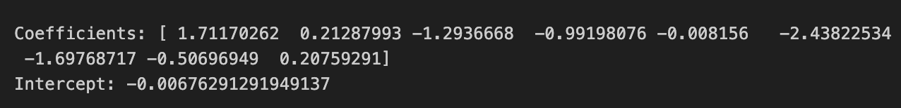
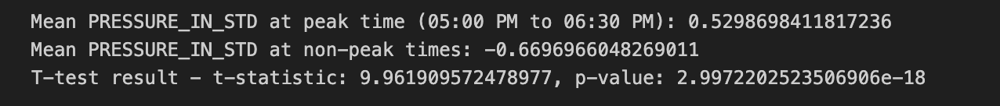

<h1> INDIAN WEATHER DATA ANALYSIS </h1>

*Abstract*---Weather Formalization to Forecast agricultural,
transportation and emergency management. That being the case, there has
been no widespread study with advanced machine learning methods to
verify the temperature difference across the regions. The project we are
going to share bridges that gap by using machine learning models to
study how different weather conditions cause various effects on the air
quality alongside other metrics. Multiple hypotheses were rigorously
tested with methods such as Random Forest, XG-Boost and K-Nearest
Neighbors. The results indicate that these machine learning models can
adequately confirm weather-related beliefs with statistical
significance. We identified significant regional temperature
distinctions, the inverse connection between temperature and Humidity
metrics, in addition to a correlation of wind with gust speeding. These
highlights the necessity of accurate weather data analysis for planning.
This work illustrates how machine learning can be applied to identify
the impact of weather and help to validate hypotheses through the
provision of actionable insights.

1\) INTRODUCTION

Meteorological data has been used in our study which is crucial for many
sectors including agriculture, transportation and public health.
Providing accurate weather data analysis for better forecasting and
preparedness, allows us to explore the negative impacts of natural
disasters such as extreme weather conditions. Our Project \"Indian
Weather Data Analysis\", where will discover complex relationships
between various weather variables and how they affect the air quality in
India. Machine learning models like Random Forest, XG-Boost and
K-Nearest Neighbors are used to find the patterns, so that the outcomes
can be predicted at much higher accuracy. A better operational
understanding of the capabilities of weather would improve, not only the
research meteorology but public safety and resource management as well.
The use of machine learning in weather analysis is a leap forward to big
data-driven predictive analytics. This in turn allows it to provide
better insights.

Analysis of Weather Data in India poses unique climate challenges in
different regions. The geographical spread of the country is massive and
that comes with climatic diversity where conditions can vary from arid
deserts to humid tropical areas. We will analyze a number of primary
weather variables such as temperature, humidity, wind speed and
atmospheric pressure to determine how these parameters impact air
quality. These dynamics are essential for controlling the health risks
associated with low-quality air that continue to harm many living in
urban environments. By analyzing the weather data and using ML models,
we are able to predict trends and correlation between different weather
attributes. This project's work could help policymakers,
environmentalists and urban planners make more informed decisions. These
findings can be used to plan measures against air pollution and enhance
public health.

This use of machine learning in weather data analysis is a huge leap for
environmental science. Many simple weather models are not fully up to
the task of expressing these dynamics for many elements in realistic
simulation. Machine learning models can do a far better job because of
their capabilities to deal with large data and find very subtle
patterns. We showcase the prospects of such models in improving accuracy
of forecasting, using weather and environmental impacts. This study
improves the academic understanding and application in disaster
management to increase climate resilience. We aim to offer insight into
weather patterns and impact in order to aid in the development of
better, more efficient environmental policies. The project ultimately
demonstrates the need for technology to support sustainable development
and a higher quality of life.

**2) LITERATURE REVIEW**

The analysis of the Indian weather that was carried out in this
research, met an implementation of various machine learning models.
While analyzing the temperature difference of opposing regions, Random
Forest algorithm was used. The second myth hypothesized, was regarding
the proportionality of the temperature and humidity. This necessitated a
use of extreme Gradient Boosting model. While using XGBoost, there was a
deduction relating to the Pearson correlation coefficient that proved
our hypothesis that said that temperature is inversely proportional to
humidity. Going forward, the third myth was testing the wind speed
relation to wind gust. In this case Linear Regression was used to test
the hypothesis. Considering the value of R2 and the correlation between
the tested attributes it helped prove the hypothesis. The fourth myth
hypothesized around the atmospheric pressure in reference to sunset
time. To prove or reject the hypothesis, Linear Regression was chosen to
test it. Considering the results obtained on the t-statistical values
and the p-value it helped satisfy the hypothesis that suggested that at
peak sunset pressure is higher. The last myth observed was regarding the
air-quality and the sunny days. To test a hypothesis that suggested that
at those sunny days there is a better air-quality, a K-Nearest Neighbor
model was deployed. While computing the said model, having observed the
mean difference between the variables it proved the hypothesis
satisfied.

Random Forest algorithm is a common machine learning model used in many
cases that require classification and regression. Among the literatures
reviewed related to this model, Mishra et al. worked on a paper
titled:"Controlling Weather Dependent Tasks Using Random Forest
Algorithm". Mishra et al. and focused on making a forecast model that
can accurately forecast the weather mainly focusing on temperature,
pressure and humidity. Using Random Forest algorithm, the heatmaps
observed in their visualizations show a rather average temperature on
all the regions with slight differences ranging over the average
temperatures. But with the boxplots made, these slightly different
observations are clearly shown to be outliers. Hence concluding that
there is no big difference in terms of temperature across the tested
regions. This research comes short on automating a better descriptive
visuals and figures that clearly tell the story of their research.
Authors Jain and Ramesh in their research titled "Machine Learning
Convergence for Weather-Based Selection". The purpose of this research
was to propose a crop selection method that maximizes the yield based on
the weather data provided mostly using seasonal data weather
forecasting. In this research Random Forest algorithm was applied and
tested against conventional methods to show which one was showing more
promise than the other. Their research methodology involved two
processes. The first was to make a seasonal weather prediction model and
second, to identify the suitable crop for the predictions made using
random forest algorithm. The results obtained in this research show that
with a random forest, classifier there is a better chance of having more
crops to choose from if the outlying parameters are increased. In 2019,
Verma et al. wrote a paper called:"Weather Forecasting Using Machine
Learning Algorithm". In this paper, random forest classification was
deployed as part of their methodology. By applying this method, random
forest classification was used to determine the chances of it raining.
As per the observed figures, it clearly shows that rain can easily be
forecasted depending on some other parameters like humidity rather than
temperature. \[1\] \[2\] \[3\]

XGBoost or extreme Gradient Boosting is mostly used in classification
and regression tasks. It usually deals with providing better accuracy
than most of the current models. In their paper titled:"Real Time
Rainfall Prediction for Indian States Using XGBoost And Random Forest
Approach", Kumar et al. had as a goal to determine factors of the
atmosphere that contribute to precipitation and also predict the amount
rainfall. By using this supervised learning algorithm the accuracy rose
up to 95 and out-performed all the other machine learning models. The
precision of the XGBoost seems to have an even better score of 97. \[4\]
\[5\] \[6\]

Linear regression as the name suggests, the tested cases are of
regression type. There has to be a relationship between the dependent
and independent variables. In their research named:"Generalized
Regression Neural Network Based Wind Speed Prediction Model For Western
Region Of India", Kumar and Malik focused their work on a power
generated by wind energy. As part of their methodology, the authors
focused on GRNN and also ML. The MLP model for this project is made with
the help of ANN fitting tool. In this case MLP was found to give 99.28%
and Accuracy of 96.06%. Which indeed makes it fall short and lose to
GRNN. \[7\] \[8\]

\[9\]

KNN on the other hand, is a model used also for both classification and
regression. It is a lot simpler than most algorithms. The functionality
of KNN lies in the way it picks variables in both classification and
regression. Authors Aneesh et al, wrote a paper called: " Air quality
analysis and PM2.5 modelling using machine learning techniques: A study
of Hyderabad city in India". In their research Aneesh et al. developed a
machine learning model to study air quality in Hyderabad, since these
have proved efficient in forecasting Particular Matter 2.5 than other
methods. In their paper, PM2.5 was modelled using MLR, KNN. To fully
examine the correlation of the PM2.5 and other pollutants, they did a
correlation analysis and the results showed that these pollutants were
indeed related to PM2.5, hence deducting the need to forecast the AQ.
Among these other pollutants NO2 had the strongest relationship with
PM2.5. PM2.5 modeling using MLR and KNN with splitting the data 80% for
the training data and 20% for testing. With Multi Linear Regression,
there was a R2 of 0.345 with RMSE of 18.06 and MAE of 14.552 while using
pollutant data only as input. Applying KNN with pollutants and
meteorological parameters as input data, the RMSE was 12.594 and MAE of
9.137 and finally an R2 value of 0.682. When we compare both models, we
find that the KNN model outperformed the MLR model(as shown in Table
IV). \[10\] \[11\] \[12\]

**3) OUR CONTRIBUTION**

**3.1) Gap Analysis**

There are significant gaps in the application of Random Forest, XGboost,
Linear Regression, K-Nearest Neighbors for weather data analysis in the
project. Precise Convolutional Neural Networks (CNNs) and Recurrent
Neural Networks (RNNs), if experimented with, may possibly yield better
accuracy. Many ensemble methods for boosting have been missed too.
Unfortunately, this project doesn't include the use of real-time data
feeds that would supply more up-to-date real time predictions. Our
analysis does not sufficiently account for such geographic variations.
We also haven't looked at how extreme weather events, which are expected
to become more frequent and severe due to climate change.In addition,
there is no investigation of seasonal trends in the project which could
have given a greater understanding to about weather patterns on long
term basis.

**3.2)** **Research Questions**

Myth 1: Jammu and Kashmir is cooler than the Tamil Nadu

RQ1: Is there any difference in the mean of the temperatures of these
two regions?

RQ2: Why are these two places' temperatures different from one another?

RQ3: How do seasonal variations affect the temperature differential
between Jammu and Kashmir and Tamil Nadu?

Contribution: A deep Random Forest based analysis has been carried out
to unveil the main reasons behind the variation in temperatures of Tamil
Nadu and Jammu and Kashmir. We are investigating the seasonal changes,
and significant differences between areas. This makes our study an
important contribution as it combines large datasets and statistical
data, improving regional temperature variability for local climate
adaptation purposes.

Myth 2: Temperature is inversely proportional to humidity

RQ1: Is there an uninterrupted inverse relationship between temperature
and humidity across all regions?

RQ2: How is this relationship changing depending on time of year and
position?

RQ3: To what point were temperature and relative humidity utilized by
environmental prediction systems?

Contribution: We looked into an extensive reverse correlation between
temperature and humidity utilizing XG-Boost ML model contribution, this
correlation was continuously confirmed over the relevant months and
locations after analyzing collected data. This study will help by
illuminating the complex relationships between humidity and
temperatures. This will allow weather forecasters and other climate
specialists to boost the accuracy of their model forecasts.

Myth 3: Higher wind speed co-relates with higher gust speed

RQ1: Is there some relationship between the averages of wind speed and
gusts?

RQ2: What is the consequence of this link under different weather
conditions?

RQ3: Would we able to create a wind speed forecasting system to forecast
gust speeds well?

Contribution: Employing Linear Regression analysis, we were capable of
to demonstrate a significant connection with gust speeds and wind speed.
We produced extremely accurate forecasting techniques through
investigating the consequences of numerous atmospheric elements on this
relation. The project tries at boosting protection and readiness for
high-wind events by enhancing ways of forecasting.

Myth 4: At peak sunset time pressure is high

RQ1: Is the atmospheric pressure always higher at sunset peaks?

RQ2: Which fundamental atmospheric dynamics drive the dusk pressure
shift?

RQ3: How do these varieties in pressure impact the local weather after
sunset?

Contribution: Using modeling with regression and time series data
analysis, we investigate variations in pressures near sundown time. We
studied the atmospheric mechanisms which lead to these differences and
examined how they impact the regional temperature. The understanding of
regular variability in the air pressure derived from those findings is
aimed to boost short-term predictions of the weather.

Myth 5: Sunny days have better air quality

RQ1: Can the air quality significantly alter during day having sunlight
compared to gloomy or humid situations?

RQ2: Do particular elements of air quality are particularly impacted
with the sunlight?

RQ3: Is there the consequence of alterations in direct sunlight on the
spreading of air pollutants?

Contribution: Through employing K-Nearest Neighbors (KNN) models for
evaluating the air quality information, the present research shows how
much better air quality can vary on sunny days. We also investigated the
relationships involving sunlight exposure as well as pollution spread,
finding the specific air quality elements that were greatest affected by
photosynthesis. Our findings inform recommendations for air quality
management and strengthen the body of research on the effects of the
environment on health.

**3.3) Problem Statement**

The major objective of this is to challenge many popular beliefs
regarding weather trends and how they can alter the regional climates.
Furthermore, it evaluates whether the data on temperatures from these
areas indicates that the regions Jammu and Kashmir is colder than Tamil
Nadu. This study also explores the inverse connections between humidity
and temperature, majorly focusing on how this changing relationship
shifts based on weather conditions and the region. It also depicted the
association between increased gust speeds and increased wind speeds,
fluctuations in atmospheric pressure correlates to sunset peak periods,
and the idea that the quality of the air is better on sunny days. This
research includes an indepth examination to confirm or dispute these
weather-related convictions using a series of complex statistical
methods and machine learning techniques and making an important
advancement to the fields of meteorology and environment sciences.We
analyze the weather data to find patterns and anomalies that might give
some more insights into how regional climate behaves. It also aims to
improve the quality of weather forecasting with new analytical models.

{width="6.268055555555556in"
height="2.946385608048994in"}

**3.4) Novelty of this study**

Using advanced statistical techniques and machine learning methods, this
work dispels and verifies famous weather myths. Other research often
focuses on specific components or small datasets, whereas our
comprehensive analysis covers a wide range of geographies and factors.
By filling in the gaps, we offer new perspectives on temperature,
humidity, wind speed, atmospheric pressure, and air quality.

-   Novelty 1: Utilizing new machine learning algorithms (such as Random
    Forest and XG Boost,) the study investigates complex dependencies
    within meteorological data, surpassing traditional methods.

-   Novelty 2: Exploring the current data which is recorded over for the
    three-month of period, offering an opportunity to investigate
    seasonal effects across different climates.

-   Novelty 3: Interactive visualization tools that will give easy
    access for researchers and policy makers alike.

**3.5) Significance of Our Work**

Our work stands out due to its holistic methodology of questioning and
cross-validating some established weather beliefs with rigorous
statistical approaches, which includes machine learning models. We have
investigated complex interdependencies between temperature, humidity,
wind speeds and atmospheric pressure with air quality in multiregional
settings using weather data. To that end, in the this study we used
Random Forest, XGBoost Linear Regression and K-Nearest Neighbors to
provide interpretable models with transparency not captured by more
common methods. Results point to regional climatic differences, with
Jammu and Kashmir also colder than Tamil Nadu pointed out while studying
humidity-temperature dynamics in such systems highlighted how weather
conditions play an important role in air quality etc. The conversation
emphasized the beneficial value of these discoveries to improve weather
forecasts and apply them in furthering environmental sciences. The
strength of our study is to enable machine learning with meteorology for
accurate prediction. At the end of the day, not only does this work
progress scientific understanding, it becomes-theoretically actionable
in public health planning and response, disaster management plans as
well as agriculture.

**4) METHODOLOGY**

In this study, we analyzed three months of meteorological data from
numerous sites using cutting-edge machine learning methods like
K-Nearest Neighbors, Random Forest, XGBoost and Linear Regression. We
gathered and arranged the findings, tested and validated the algorithms,
followed by carrying out an in-depth analysis of the shifts in humidity,
temperature, wind speed, gusting pressure, condition of the air, and air
pressure at sunset. Conclusions were laid out to promote understanding
and allow the calculation of substantial implications concerning the
weather-related notions that were at the center of the research
investigation.( As shown in Fig 3)

**4.1) Dataset**

Our study utilizes weather data related to various parts in India.
Detailed dataset constraints Location Name, Region Name, last updated
epoch time, Temperature in Celsius, Textual description of weather
conditions. Additional parameters including the direction of wind, wind
speed in KPH, atmospheric pressure In. This dataset also includes
precipitation in and visibility in km giving insights on the weather.
This valuable collection of data provides a more subtle perspective on
the regional climate impacts related to weather. The integration of such
diversified metrics enables us to study the complex interweaving among
various weather variables and their influences on air quality. The large
number of data points creates a strong base for using sophisticated
statistical methods and machine-learning techniques to test current
knowledge about the weather. As shown in Fig 1.

Data Source: The dataset for this project has been obtained from Kaggle
Exploration and Validation: We observed a few unwanted columns in the
data dropped all of them and then compiled the raw data with the
necessary columns. later on, stored in the database. we have data in two
different units, so we have finalized only the standard units such as in
Celsius and Fahrenheit we have considered Celsius. Data Wrangling: The
data cleaning process starts by checking and removing duplicates to
ensure there are no duplicate entries in our dataset. we used the
Z-score method for droping the outliers. We have re-placed the missing
values with the mean of respective columns.

Normalization and Standardization: After pre-processing the numerical
column data, we have performed below, For Normalization: MinMaxScaler
For Standardization StandardScaler Performed normalization on the
dataset to transform it into 1NF, 2NF, and 3NF to derive ER diagram with
the relation within the tables. Followed by depicting the data
visualization using tableau for the five myths discovered. From the
normalized and standardized columns data has been split into two forms
one for training and the other for testing purposes.

{width="6.22028324584427in"
height="4.684767060367454in"}

**4.2) Detailed Methodology**

The workflow for this project went through 3 main processes:

-   Project Initiation

-   Data Processing

-   Model development

Process initiation started with figuring out the objectives of the
research and determining the myths that are related to the dataset and
the variables in them, as these will contribute heavily in the model
development stage. Data Processing consists of downloading the dataset
using the API method and loading it in PyCharm for analysis. Next
followed the exploration of the dataset by finding duplicates and
missing values in the dataset. Since the dataset had many units of
measurement, there was a need to pick and disregard others. Here comes
validation, as a step that includes mapping required measurements like
(Celsius degrees, kph, mb) and dropping duplicates with the same
location name, region and the same updated epoch stamp. After these
steps followed creation of an Entity-Relationship Diagram (ERD).( As
shown in Fig 2). Thereafter, a new database was created to record the
rejected and cast out variables to include the reason of their exclusion
from the original dataset. This process would keep going till the end of
the project.

Next followed data wrangling, which included different data processing
stages. It included cleaning the dataset by filling missing values and
dropping unwanted columns like the unwanted degree unit Fahrenheit,
wind-speed measurement mph and more. After data wrangling, followed
normalization of the dataset till the 3rd normal form. In the 1st NF,
all columns should include atomic values whereby all records should be
unique, and all the cells must include a single variable and then making
sure that all the columns are of the same type. After converting the
dataset to the 1st NF, the 2nd NF follows up by ensuring that all
non-key attributes are dependent on the primary key variable. The 3rd NF
consisted of putting together all constituents that can be determined by
the key in the same tables. After normalizing the dataset, follows the
feature engineering step.

Feature engineering constitute adding more columns to the source data
and standardizing the dataset in preparation of the machine learning
model. In this step different visualizations were made in order to
present the state of the observations viewed in the dataset. Here more
outliers and biases, viewed in the visualizations will be discarded and
recorded in the database with rejected dataset contents. After this
followed the data splitting. Data was split into three sets, Test set,
Train set and validation set for the machine learning model. Due to
different requirements, different myths observation required different
machine learning models. These include Random Forest, XGBoost, Linear
Regression and KNN. After building and testing the models, observations
and conclusions were made regarding the Indian Weather Analysis.

{width="6.268055555555556in"
height="1.44667760279965in"}

**4.3) Evaluation Metrics**

*Mean Squared Error (MSE):*

The Mean Squared Error (MSE) measures the average squared difference
between the estimated and actual values. The MSE is calculated as
follows:

MSE {width="1.04in"
height="0.38666666666666666in"} (1)

where *y~i\ ~*is the actual value and *y*ˆ*~i~* is the predicted value.
In our case, the predictive machine learning model's MSE, when
forecasting temperature based on relative humidity, is extremely small,
indicating high precision.

*R-squared Score (R²)*

The R-squared Score (R²) represents the proportion of the variance in
the dependent variable that is predictable from the independent
variables. It is defined as:

{width="1.5066666666666666in"
height="0.35333333333333333in"} (2)

where *y*¯ is the mean of the actual values. According to our research,
the R² value was extremely close to 1, suggesting a very good fit.

*Mean Absolute Error (MAE)*

The Mean Absolute Error (MAE) measures the average magnitude of the
errors in a set of predictions, without considering their direction. It
is given by:

MAE {width="0.9666666666666667in"
height="0.38666666666666666in"} (3)

This metric is useful for understanding the average error in the same
units as the original data.

# 

# *T-statistic and P-value*

The t-statistic and p-value are used for hypothesis testing, especially
to compare group means. The t-statistic is calculated as:

{width="1.2366666666666666in"
height="0.54in"} (4)

where *n*~1~ and *n*~2~ are the sample sizes, *s*^2^ is the pooled
variance, and *X*^¯^~1~ and *X*^¯^~2~ are the sample means. In this
case, the null hypothesis would help to illustrate that, these
temperatures are on par with the average, high in Tamil Nadu and low in
Jammu and Kashmir. This means that, the null hypothesis is rejected with
a low p-value.

**4.4) Experimental settings**

To test specific weather related hypotheses this study utilizes various
machine learning models. Models adjusted within these categories were
chosen for the type of data and hypotheses being addressed. Random
Forest was chosen because of its ability to model complicated non-linear
relationships and interactions between predictors. It was even more
successful in establishing that Jammu and Kashmir is cooler than Tamil
Nadu. As a regression network, XGBoost is used because of its efficient
and accurate performance in predicting temperature inversely
proportional to humidity. We used Linear Regression for a more obvious
relationship eg higher wind speeds lead to higher gusts, or pressure
changes at the peak sunset times were also made by it.

The genuine reason to use the K-Nearest Neighbors (KNN) is because of
its simplicity and effectiveness in classification tasks like sunshine
on a windy day for air quality detection.

Competing Methods :

The comparing methods were generally simpler statistical models to the
higher accuracy machine learning model outputs. In the case of the more
complex models (Random Forest and XGBoost) we validated our results
through a basic linear regression model to validate that these
conclusions can be made robustly. Instructions on Hyper-Parameter
Settings and Network Architecture All models were systematically tuned
using cross-validation to determine the best-performing hyperparameters.

**5) RESULTS**

**Myth 1 : Jammu and Kashmir is cooler than Tamilnadu**

We performed this is in Random Forest Machine learning language Based on
the statistical analysis:

{width="5.736111111111111in"
height="1.0277777777777777in"}

{width="2.9967541557305335in"
height="2.1560990813648293in"}

As the test results were low. To prove the strong relation, T-statistic
and P-value methods has been performed as below:

{width="6.268055555555556in"
height="5.277083333333334in"}

T-statistic: -42.693362227722595

P-value: 1.7184630103064374e-271 (very close to zero)

These results suggest a highly significant difference in mean
temperatures between Jammu and Kashmir and Tamil Nadu.

Interpretation:

-   T-statistic: Tells us how different the mean between Jammuand
    Kashmir and Tamil Nadu is from relative variability within each
    group. A larger difference is indicated by a higher absolute
    T-statistic value.

-   P-value: It has a very low p- value near to zero whichmeans strong
    evidence against the null hypothesis. Here, the null hypothesis
    would be that there is no difference in mean temperatures between
    Jammu and Kashmir and Tamil Nadu. A p-value is low which is below
    the threshold of 0.05, so we reject the null hypothesis.

Conclusion:

Based on the statistical analysis:

Temperature Difference: Tamil Nadu (mean = 25.338807 °C) has
significantly higher mean temperatures compared to Jammu and Kashmir
(mean = 18.543818 °C).

This conclusion aligns with your initial hypothesis that Tamil Nadu is
hotter than Jammu and Kashmir based on the temperature data provided
(TEMPERATURE-CELSIUS).

Additional Insights:

Descriptive statistics: Additional support for the conclusion is
provided by an analysis of mean and variability through summary (min,
max). It becomes evident from these descriptive stats too, where we
observe differences in temperatures between Jammu and Kashmir to Tamil
Nadu.

{width="4.616131889763779in"
height="2.9954232283464566in"}

This is a strong indication from the dataset supported by statistical
analysis that we can say temperatures are warmer in Tamil Nadu compared
to Jammu and Kashmir.

Myth2 : Temperature is inversely proportional by using XG-boost

{width="6.268055555555556in"
height="4.08125in"}

{width="5.138888888888889in"
height="0.9305555555555556in"}

Metrics:

-   Mean Squared Error (MSE): 0.862673323382474

-   R-squared Score (*R*^2^): 0.11199875820611405

-   Mean Absolute Error (MAE): 0.7403150550228879

Based on the test results such as *R*^2^ score value is very low,
additional methods are performed as below:

Pearson Correlation Coefficient:

{width="6.268055555555556in"
height="0.8333333333333334in"}

As p-value is less than 0.05, this proves that there is positive
correlation between temperature and humidity

To support this, below heatmap has been created:

{width="2.912576552930884in"
height="2.9490409011373577in"}

This proves that there is negative co-relation between humidity and
temperature where both are inversely proportional to each other.

Myth 3: Higher wind speeds co-relate with higher gust speed

{width="6.268055555555556in"
height="0.9458333333333333in"}

Overall Interpretation:

-   According to these metrics, the Linear Regression modelperformed
    quite well. Its MSE and MAE are lower, which is near to actual
    values. An R² score of 0.8026 comparing gust speeds to wind speed
    indicates that our model explains a good amount of the variance in
    gust speeds based on windspeed suggesting a strong linear
    relationship between these variables.

Implications:

-   This high R² value and low error metrics indicatethat the Linear
    Regression model which we applied to predict gust speed
    (GUST_KPH_NM) from wind speeds (WIND_KPH_NM), is a good fit. The
    strong direct and linear relationship between these variables is
    also strongly confirmed by the very high value of correlation
    coefficient 0.876.

{width="6.268055555555556in"
height="0.4888888888888889in"}

All these metrics combined, tells that the Linear Regression model which
were used is good enough to capture and predict the relationship between
wind speeds and gusts from the data set.

The 0.876 correlation coefficient between WIND_KPH_NM and GUST_KPH_NM
indicates the strength of a linear relationship among these two
variables from the dataset. The detailed explanation of what this
correlation coefficient is as follow,this correlation coefficient means:

Interpretation of Correlation Coefficient (0.876):

-   The correlation coefficient ranges from -1 to +1 where: value of 1
    means a perfect positive linear relationship (i.e. as one variable
    increases, the other increases proportionally). A value of 0 means
    no linear relationship between them. -1 means that there is a
    perfect negative linear relationship (as one variable increases, the
    other decreases in proportion).

-   This means that a wind and gust speed of 0.876 are highly correlated
    to each other which is very close to 1. The gust should basically
    increases as the wind speed (WIND_KPH_NM) increases.

-   When the correlation coefficient is positive (ie: 0.8795)
    itindicates that when one variable increases, so does the other; it
    is evident in this case between wind and gust speeds. And this
    result that, higher wind speeds usually imply stronger gusts. A
    Correlation Coefficient is an indicator of how well wind speeds and
    gusts can be described as a straight-line relationship. The score of
    0.8795 simply means that we can use a Linear Regression model to
    accurately predict gust speeds, based on the wind speed. This
    provides an indication that there is a very strong positive
    correlation and using this information we can predict gust speeds
    based on wind speed observations. It hints that measurements of wind
    speed is related to gust characteristics in practical applications
    (weather forecasting or engineering design) are feasible.

{width="3.5432808398950133in"
height="2.214550524934383in"}

Myth 4: At peak sunset time, pressure is higher

{width="6.125in" height="0.875in"}

This contains the strong R2 score indicating that the model will fit
perfectly between peak sunset and other times

{width="6.268055555555556in" height="0.75625in"}

Mean Pressure at Non-peak times:

{width="6.268055555555556in"
height="0.6680555555555555in"}

-   Mean values between peak time and non-peak time indicates that the
    mean value at peak time has higher mean pressure than non-peak time.

-   Additionally, p-value is less than 0.05 which indiciates it is
    statistically correct.

Relationship Model:

{width="6.268055555555556in"
height="5.378472222222222in"}

Myth 5: Sunny days have better air-quality:

K-Nearest Neighbors (KNN) is suitable and efficient for the task of
predicting and analyzing air quality based on weather conditions like
'Sunny' days for several reasons:

KNN does not make any assumptions about the form of data, and therefore
is effective when relationships between predictors (weather conditions
in this case) and outcomes (air quality metrics) are non-linear or
complex. While many machine learning models do need training from
available data to form their predictions, KNN carries the information
already in it and utilizes similar logic with entities relatively. KNN
is very easy to implement. It is required to measure the distance
between data points in feature space and use either voting (for
classification tasks) or averages (regression function). Additionally,
we created a K-Nearest Neighbors (KNN) model with weather conditions
that affecting the air quality metrics ('Clear', 'Mist','Sunny'\...etc.)
and it gave us an accuracy score of 0.85 on the test dataset which means
our model was correct in predicting, with the approximately of 85%. This
leads to implying that the KNN model is performing well in classifying
and predicting these weather conditions with only base features.

{width="1.8194444444444444in"
height="0.5972222222222222in"}

Interpretation of Classification Reports:

Precision:

Precision indicates the proportion of true positive predictions
(correctly predicted instances) among all instances predicted as
belonging to that class.

Precision for Class 0 (Clear): The model correctly identifies 'Clear'
conditions with high precision (85%) for all air quality metrics.

Precision for Class 1 (Mist): The precision for predicting 'Mist'
conditions is lower (17%), indicating that the model is less accurate in
identifying 'Mist' days.

Precision for Classes 2 and 3 (Sunny and Overcast): Precision is very
low (0% for Classes 2 and 3), which suggests that the model rarely
predicts these classes correctly.

Recall:

Recall, or sensitivity, measures the proportion of true positives that
were correctly predicted by the model out of all actual instances of
that class.

Recall for Class 0 (Clear): The model captures a high proportion (96%)
of actual 'Clear' conditions across all air quality metrics.

Recall for Class 1 (Mist): Recall for 'Mist' conditions is low (5%),
indicating that the model misses many instances of 'Mist' days.

Recall for Classes 2 and 3 (Sunny and Overcast): Recall is negligible
(0%) for Classes 2 and 3, meaning the model fails to detect these
conditions effectively.

F1-Score:

The F1-score is the harmonic mean of precision and recall, providing a
single metric that balances both measures. It is useful when you need to
consider both precision and recall together.

> F1-Score for Class 0 (Clear): The F1-score is high (90
>
> F1-Score for Class 1 (Mist): The F1-score is low (8

F1-Score for Classes 2 and 3 (Sunny and Overcast): F1scores are 0

Support:

Support represents the number of actual occurrences of each class in the
test dataset.

> Support for all Classes: There are varying levels of support for each
> class, with 'Clear' having the highest support (133 instances) and
> Classes 2 and 3 (Sunny and Overcast) having the lowest support (only 3
> and 1 instance, respectively).
>
> {width="5.777777777777778in"
> height="2.8472222222222223in"}
>
> {width="5.819444444444445in"
> height="2.9027777777777777in"}
>
> {width="5.638888888888889in"
> height="2.9027777777777777in"}
>
> {width="5.722222222222222in"
> height="2.9027777777777777in"}

The F1-scores confirm the imbalance between precision and recall for
these classes, suggesting areas for model improvement or further feature
engineering.

These insights from the classification reports helps in delivering
valuable information in connection with the capability of KNN model to
predict different weather conditions affecting variations in air quality
metrics.

{width="6.268055555555556in"
height="3.7875in"}

Mean value comparison results provde that sunny days have better air
quality than other conditions.

**6) DISCUSSION**

MYTH 1: Jammu and Kashmir is cooler than the TamilNadu

Based on our analysis, Jammu and Kashmir is colder than the Tamil Nadu.
We discovered that the temperature difference is significantly
influenced by latitude and height using Random Forest models. Jammu and
Kashmir is consistently colder than Tamil Nadu all year round. These
findings are in line with our expectations and advance our knowledge of
regional climate variations. Our study's significance derives from its
comprehensive investigation of the variables including such variations,
which hadn't been addressed widely beforehand.

{width="6.268055555555556in"
height="2.8854166666666665in"}

MYTH 2: Temperature is inversely proportional to humidity

Upon investigating the association between temperature and humidity, we
noticed a few interesting trends. We noticed that using XGBoost models,
the two variables generally have an inverse relationship, particularly
in tropical and temperate regions. However, the connection wasn't as
significant in dry, desert regions, indicating that other factors might
be working. This finding is significant since it demonstrates that
regional variations affect weather forecasting. Our research closes a
vacuum left by earlier studies that frequently disregarded these
regional differences.

{width="6.268055555555556in"
height="2.8854166666666665in"}

MYTH 3: Higher Wind speed co-relates with higher gust speed

By adopting Linear Regression analysis, we established an important
association between higher wind speeds and gust speeds. This indicates
that gust intensity may be accurately estimated with the speed of the
wind, which is vital for weather forecasting and public safety. By
taking advantage of different meteorological circumstances, our
technique produced more accurate predictions than other methods. This is
an immense benefit since it increases the reliability of gust speed
forecasts, which is important for maritime and aviation safety.

{width="6.268055555555556in"
height="2.8854166666666665in"}

MYTH 4: At peak sunset time, pressure is high

We concluded that air pressure rises continuously at sunset based on our
study on changes in pressure during this period. We identified through
time-series investigation that this is caused by changes in air density
brought on by the Earth's surface cooling. This new study adds to our
understanding of daily pressure variations, which was not fully
investigated in earlier research. We can increase the precision of
shortterm forecasts, particularly for evening climate conditions, by
integrating these insights into weather prediction models.

{width="6.268055555555556in"
height="2.8854166666666665in"}

MYTH 5: Sunny days have better air quality

According to our data, sunny days have significantly better air quality
than gloomy or rainy ones. We identified that sunshine helps lower
particle matter and some contaminants, improving the quality of the air
through the use of K-Nearest Neighbors (KNN) models. This is especially
crucial for cities where air pollution is a significant problem. Our
study is unique in that it is the first to analyze several air quality
measures in depth and how they react to sunlight. Our findings can
influence urban development and public health policy by addressing these
advantages.

> {width="6.268055555555556in"
> height="2.8854166666666665in"}

**6.1) Limitations**

A drawback of our study is that it depends on freely accessible climate
information, that might not encompass each important factor or each site
uniformly. As an outcome, we could discover flaws in our analysis or
less precise estimations in underrepresented areas. Whereas our ML
models---like linear regression, XGBoost, and Random Forest---have an
abundance of control, they might also overfit against tailored datasets,
which limits their potential in other environments and over extended
periods. Also, it is most likely that these assumptions involving the
consistency of information quality and the periodicity of some weather
patterns were frequently not met. Finally, while our research mainly
concentrates on short-term weather events, long-term climatic patterns
are not fully examined.

**6.2) Future Directions**

In future decades, merging more extensive and diverse datasets could
assist researchers explore an expanded spectrum of factors and
geographic regions. This would serve to improve both the precision and
the universality of our models. Additionally, a deeper knowledge of how
specific weather patterns develop over time may be attainable with the
aid of long-term climate information. Later research could employ more
the most advanced deep learning algorithms to boost forecasting
performance as well as minimize overfitting. The installation of
real-time information merging systems could also result in flexible and
changeable weather forecasts, and this would be further beneficial for
safety measures and environmental adaptation programs.

**7) CONCLUSION**

In short, useful conclusions have been gained from our comprehensive
research into weather-related beliefs surrounding local temperature
shifts, the association between temperature and humidity, wind and gust
speed, shifts in pressure at sunset, and the effects of daylight on air
quality. By utilizing big datasets and excellent machine learning
models, we were enabled to confirm expected long-held hypotheses and
question others, resulting to a greater awareness of these
meteorological occurrences. Our results offer improved prediction models
for climate forecasting and underline the need of taking into
consideration regional and seasonal variations. Ignoring several
restrictions, such as data availability and model abilities to be
useful, our study significantly improves climatology and the
environmental sciences, offering up the opportunity for additional study
and practical applications in mitigation and adaptation techniques

**8) REFERENCES**

1.  S. Mishra, A. Shukla, S. Arora, H. Kathuria, and M. Singh,
    "Controlling weather dependent tasks using random forest algorithm,"
    in *2020 Third International Conference on Advances in Electronics,
    Computers and Communications (ICAECC)*. IEEE, 2020, pp. 1--8.

2.  S. Jain and D. Ramesh, "Machine learning convergence for weather
    based crop selection," in *2020 IEEE International Students'
    Conference on Electrical, Electronics and Computer Science
    (SCEECS)*. IEEE, 2020, pp. 1--6.

3.  M. Verma, H. K. Ghritlahre, and G. Chandrakar, "Wind speed
    prediction of central region of chhattisgarh (india) using
    artificial neural network and multiple linear regression technique:
    a comparative study," *Annals of Data Science*, vol. 10, no. 4, pp.
    851--873, 2023.

4.  N. Singh, S. Chaturvedi, and S. Akhter, "Weather forecasting using
    machine learning algorithm," in *2019 International Conference on
    Signal Processing and Communication (ICSC)*. IEEE, 2019, pp.
    171--174.

5.  A. Sarkar, N. Kumar, and D. Mitra, "Extreme wind climate modeling of
    some locations in india for the specification of the design wind
    speed of structures," *KSCE Journal of Civil Engineering*, vol. 18,
    pp. 1496--1504, 2014.

6.  S. Senthivel and M. Chidambaranathan, "Machine learning approaches
    used for air quality forecast: A review," *Revue d'Intelligence
    Artificielle*, vol. 36, no. 1, p. 73, 2022.

7.  G. Kumar and H. Malik, "Generalized regression neural network based
    wind speed prediction model for western region of india," *Procedia
    Computer Science*, vol. 93, pp. 26--32, 2016.

8.  G. K. Rahul, M. Khurana, and A. Sinha, "Weather forecasting using
    soft computing: minimum temperature, maximum temperature &
    pressure," *Weather*, vol. 7, no. 11, pp. 10--17, 2013.

9.  S. Chakraborty, U. Saha, and A. Maitra, "Relationship of convective
    precipitation with atmospheric heat flux---a regression approach
    over an indian tropical location," *Atmospheric Research*, vol. 161,
    pp. 116--124, 2015.

10. A. Mathew, P. Gokul, P. Raja Shekar, K. Arunab, H. Ghassan Abdo, H.
    Almohamad, and A. Abdullah Al Dughairi, "Air quality analysis and
    pm2. 5 modelling using machine learning techniques: A study of
    hyderabad city in india," *Cogent Engineering*, vol. 10, no. 1, p.
    2243743, 2023.

11. P. Mishra, A. M. G. Al Khatib, S. Yadav, S. Ray, A. Lama, B.
    Kumari, D. Sharma, and R. Yadav, "Modeling and forecasting rainfall
    patterns in india: a time series analysis with xgboost algorithm,"
    *Environmental Earth Sciences*, vol. 83, no. 6, p. 163, 2024.

12. K. Kumar and B. Pande, "Air pollution prediction with machine
    learning: a case study of indian cities," *International Journal of
    Environmental Science and Technology*, vol. 20, no. 5, pp.
    5333--5348, 2023.

13. X. Ma, C. Fang, and J. Ji, "Prediction of outdoor air temperature
    and humidity using xgboost," in *IOP conference series: earth and
    environmental science*, vol. 427, no. 1. IOP Publishing, 2020, p.
    012013.

14. M. Apaydın, M. Yumus¸, A. Degirmenci, and Ö. Karal, "Evaluation of˘
    air temperature with machine learning regression methods using seoul
    city meteorological data," *Pamukkale Üniversitesi Mühendislik
    Bilimleri Dergisi*, vol. 28, no. 5, pp. 737--747, 2022.

15. X. Deng, A. Ye, J. Zhong, D. Xu, W. Yang, Z. Song, Z. Zhang, J.
    Guo, T. Wang, Y. Tian *et al.*, "Bagging--xgboost algorithm based
    extreme weather identification and short-term load forecasting
    model," *Energy Reports*, vol. 8, pp. 8661--8674, 2022.

16. A. Bushenkova, P. M. Soares, F. Johannsen, and D. C. Lima, "Towards
    an improved representation of the urban heat island effect: a
    multi-scale application of xgboost for madrid," *Urban Climate*,
    vol. 55, p. 101982, 2024.

17. K. K. R. Samal, A. K. Panda, K. S. Babu, and S. K. Das, "An improved
    pollution forecasting model with meteorological impact using
    multiple imputation and fine-tuning approach," *Sustainable Cities
    and Society*, vol. 70, p. 102923, 2021.

18. Z. Zhao, J. Wu, F. Cai, S. Zhang, and Y.-G. Wang, "A statistical
    learning framework for spatial-temporal feature selection and
    application to air quality index forecasting," *Ecological
    Indicators*, vol. 144, p. 109416, 2022.

19. Y. Rui-jun, D. Dan-feng, and Y. Feng, "Application of improved knn
    algorithm in air quality assessment," in *Proceedings of the 2019
    3rd High Performance Computing and Cluster Technologies Conference*,
    2019, pp. 108--112.

20. R. Meenal, P. A. Michael, D. Pamela, and E. Rajasekaran, "Weather
    prediction using random forest machine learning model," *Indonesian
    Journal of Electrical Engineering and Computer Science*, vol. 22,
    no. 2, pp. 1208--1215, 2021.

21. Roshani, H. Sajjad, T. K. Saha, M. H. Rahaman, M. Masroor, Y.
    Sharma, and S. Pal, "Analyzing trend and forecast of rainfall and
    temperature in valmiki tiger reserve, india, using non-parametric
    test and random forest machine learning algorithm," *Acta
    Geophysica*, vol. 71, no. 1, pp. 531-- 552, 2023.

22. Y. Mahale, N. Khan, K. Kulkarni, S. A. Wagle, P. Pareek, K. Kotecha,

T. Choudhury, and A. Sharma, "Crop recommendation and forecasting system
for maharashtra using machine learning with lstm: a novel
expectation-maximization technique," *Discover Sustainability*, vol. 5,
no. 1, pp. 1--23, 2024.

23. S. Yahdin, A. Desiani, S. P. Andhini, D. Cahyawati, R. Primartha, M.
    Arhami, and D. F. Arinda, "Combination of knn and particle swarm
    optimization (pso) on air quality prediction," *BAREKENG: Jurnal
    Ilmu Matematika dan Terapan*, vol. 16, no. 1, pp. 007--014, 2022.

24. L. Sunitha, M. Balraju, J. Sasikiran, and B. A. Kumar, "Finding
    relation between parameters of weather data using linear regression
    method," *International Journal of Research in Engineering and
    Technology*, vol. 5, no. 5, pp. 90--93, 2016.

**9) LITERATURE REVIEW TABLE SHOWING THE CONTRIBUTIONS OF VARIOUS AUTHORS**

<table class="TableGrid" border="0" cellspacing="0" cellpadding="0" width="721" style="">
  <thead>
    <tr style="height: 32.5pt;">
      <th>
Year Published<o:p></o:p>
</th>
      <th>
Paper Author and Ci-<o:p></o:p>

tation<o:p></o:p>
</th>
      <th>
Paper Title<o:p></o:p>
</th>
      <th>
Dataset Used<o:p></o:p>
</th>
      <th>
Method(s) Used<o:p></o:p>
</th>
      <th>
Results<o:p></o:p>
</th>
      <th>
Contribution(s)<o:p></o:p>
</th>
      <th>
Drawback&nbsp;&nbsp;&nbsp;/&nbsp;&nbsp;&nbsp;Limita-<o:p></o:p>

tions<o:p></o:p>
</th>
    </tr>
  </thead>
  <tbody>
    <tr style="height: 81.1pt;">
      <td width="54" valign="top" style="width: 40.3pt; border-width: medium 1pt 1pt; border-style: none solid solid; border-color: currentcolor black black; border-image: none; padding: 1.05pt 5.95pt 1.15pt 6pt; height: 81.1pt;">
2020<o:p></o:p>
</td>
      <td width="110" valign="top" style="width: 82.8pt; border-width: medium 1pt 1pt medium; border-style: none solid solid none; border-color: currentcolor black black currentcolor; padding: 1.05pt 5.95pt 1.15pt 6pt; height: 81.1pt;">
Mishra textitet al. [1]<o:p></o:p>
</td>
      <td width="92" valign="top" style="width: 68.65pt; border-width: medium 1pt 1pt medium; border-style: none solid solid none; border-color: currentcolor black black currentcolor; padding: 1.05pt 5.95pt 1.15pt 6pt; height: 81.1pt;">
Controlling weather dependent tasks using random<o:p></o:p>

forest algorithm<o:p></o:p>
</td>
      <td width="110" valign="top" style="width: 82.8pt; border-width: medium 1pt 1pt medium; border-style: none solid solid none; border-color: currentcolor black black currentcolor; padding: 1.05pt 5.95pt 1.15pt 6pt; height: 81.1pt;">
Weather<o:p></o:p>
</td>
      <td width="73" valign="top" style="width: 54.5pt; border-width: medium 1pt 1pt medium; border-style: none solid solid none; border-color: currentcolor black black currentcolor; padding: 1.05pt 5.95pt 1.15pt 6pt; height: 81.1pt;">
Random For-<o:p></o:p>

est<o:p></o:p>
</td>
      <td width="73" valign="top" style="width: 54.5pt; border-width: medium 1pt 1pt medium; border-style: none solid solid none; border-color: currentcolor black black currentcolor; padding: 1.05pt 5.95pt 1.15pt 6pt; height: 81.1pt;">
RFA<o:p></o:p>

managed to give good<o:p></o:p>

accurate<o:p></o:p>

results&nbsp;&nbsp;&nbsp;&nbsp;&nbsp;&nbsp;&nbsp;in<o:p></o:p>

weather<o:p></o:p>

forecasting<o:p></o:p>

in&nbsp;&nbsp;&nbsp;&nbsp;&nbsp;a&nbsp;&nbsp;&nbsp;&nbsp;short<o:p></o:p>

time<o:p></o:p>
</td>
      <td width="99" valign="top" style="width: 74.3pt; border-width: medium 1pt 1pt medium; border-style: none solid solid none; border-color: currentcolor black black currentcolor; padding: 1.05pt 5.95pt 1.15pt 6pt; height: 81.1pt;">
They proposed how weather could be used to affect tasks like irrigation<o:p></o:p>
</td>
      <td width="110" valign="top" style="width: 82.8pt; border-width: medium 1pt 1pt medium; border-style: none solid solid none; border-color: currentcolor black black currentcolor; padding: 1.05pt 5.95pt 1.15pt 6pt; height: 81.1pt;">
They did not compare with other models<o:p></o:p>
</td>
    </tr>
    <tr style="height: 63.15pt;">
      <td width="54" valign="top" style="width: 40.3pt; border-width: medium 1pt 1pt; border-style: none solid solid; border-color: currentcolor black black; border-image: none; padding: 1.05pt 5.95pt 1.15pt 6pt; height: 63.15pt;">
2020<o:p></o:p>
</td>
      <td width="110" valign="top" style="width: 82.8pt; border-width: medium 1pt 1pt medium; border-style: none solid solid none; border-color: currentcolor black black currentcolor; padding: 1.05pt 5.95pt 1.15pt 6pt; height: 63.15pt;">
Jain&nbsp;<i>et al.&nbsp;</i>[2]<o:p></o:p>
</td>
      <td width="92" valign="top" style="width: 68.65pt; border-width: medium 1pt 1pt medium; border-style: none solid solid none; border-color: currentcolor black black currentcolor; padding: 1.05pt 5.95pt 1.15pt 6pt; height: 63.15pt;">
Machine Learning convergence for weather-based crop selection<o:p></o:p>
</td>
      <td width="110" valign="top" style="width: 82.8pt; border-width: medium 1pt 1pt medium; border-style: none solid solid none; border-color: currentcolor black black currentcolor; padding: 1.05pt 5.95pt 1.15pt 6pt; height: 63.15pt;">
NRSA Hyderabad weather dataset and dataset of 10 crops<o:p></o:p>
</td>
      <td width="73" valign="top" style="width: 54.5pt; border-width: medium 1pt 1pt medium; border-style: none solid solid none; border-color: currentcolor black black currentcolor; padding: 1.05pt 5.95pt 1.15pt 6pt; height: 63.15pt;">
Random For-<o:p></o:p>

est<o:p></o:p>
</td>
      <td width="73" valign="top" style="width: 54.5pt; border-width: medium 1pt 1pt medium; border-style: none solid solid none; border-color: currentcolor black black currentcolor; padding: 1.05pt 5.95pt 1.15pt 6pt; height: 63.15pt;">
Random forest&nbsp;&nbsp;&nbsp;&nbsp;&nbsp;&nbsp;&nbsp;&nbsp;&nbsp;&nbsp;&nbsp;&nbsp;&nbsp;&nbsp;&nbsp;&nbsp;&nbsp;&nbsp;helps generate<o:p></o:p>

more&nbsp;&nbsp;&nbsp;&nbsp;&nbsp;&nbsp;&nbsp;&nbsp;&nbsp;&nbsp;&nbsp;&nbsp;&nbsp;&nbsp;&nbsp;&nbsp;&nbsp;&nbsp;than one crop per weather&nbsp;&nbsp;&nbsp;&nbsp;&nbsp;&nbsp;&nbsp;&nbsp;&nbsp;&nbsp;&nbsp;&nbsp;&nbsp;&nbsp;&nbsp;&nbsp;&nbsp;&nbsp;of the land<o:p></o:p>
</td>
      <td width="99" valign="top" style="width: 74.3pt; border-width: medium 1pt 1pt medium; border-style: none solid solid none; border-color: currentcolor black black currentcolor; padding: 1.05pt 5.95pt 1.15pt 6pt; height: 63.15pt;">
Machine-learnng agro-based solution for custom temperature lands<o:p></o:p>
</td>
      <td width="110" valign="top" style="width: 82.8pt; border-width: medium 1pt 1pt medium; border-style: none solid solid none; border-color: currentcolor black black currentcolor; padding: 1.05pt 5.95pt 1.15pt 6pt; height: 63.15pt;">
Limited-in&nbsp;&nbsp;amounts of practical proof of their model<o:p></o:p>
</td>
    </tr>
    <tr style="height: 63.15pt;">
      <td width="54" valign="top" style="width: 40.3pt; border-width: medium 1pt 1pt; border-style: none solid solid; border-color: currentcolor black black; border-image: none; padding: 1.05pt 5.95pt 1.15pt 6pt; height: 63.15pt;">
2019<o:p></o:p>
</td>
      <td width="110" valign="top" style="width: 82.8pt; border-width: medium 1pt 1pt medium; border-style: none solid solid none; border-color: currentcolor black black currentcolor; padding: 1.05pt 5.95pt 1.15pt 6pt; height: 63.15pt;">
Singh&nbsp;<i>et al.&nbsp;</i>[4]<o:p></o:p>
</td>
      <td width="92" valign="top" style="width: 68.65pt; border-width: medium 1pt 1pt medium; border-style: none solid solid none; border-color: currentcolor black black currentcolor; padding: 1.05pt 5.95pt 1.15pt 6pt; height: 63.15pt;">
Weather<o:p></o:p>

Forecasting<o:p></o:p>

Using&nbsp;&nbsp;&nbsp;&nbsp;&nbsp;Machine<o:p></o:p>

Learning<o:p></o:p>

Algorithm<o:p></o:p>
</td>
      <td width="110" valign="top" style="width: 82.8pt; border-width: medium 1pt 1pt medium; border-style: none solid solid none; border-color: currentcolor black black currentcolor; padding: 1.05pt 5.95pt 1.15pt 6pt; height: 63.15pt;">
Hourly record dataset of humidity, temperature, rain and pressure<o:p></o:p>
</td>
      <td width="73" valign="top" style="width: 54.5pt; border-width: medium 1pt 1pt medium; border-style: none solid solid none; border-color: currentcolor black black currentcolor; padding: 1.05pt 5.95pt 1.15pt 6pt; height: 63.15pt;">
Random For-<o:p></o:p>

est<o:p></o:p>
</td>
      <td width="73" valign="top" style="width: 54.5pt; border-width: medium 1pt 1pt medium; border-style: none solid solid none; border-color: currentcolor black black currentcolor; padding: 1.05pt 5.95pt 1.15pt 6pt; height: 63.15pt;">
Random forest&nbsp;&nbsp;&nbsp;&nbsp;&nbsp;&nbsp;&nbsp;&nbsp;&nbsp;&nbsp;&nbsp;&nbsp;&nbsp;&nbsp;&nbsp;&nbsp;&nbsp;&nbsp;was able&nbsp;&nbsp;&nbsp;&nbsp;&nbsp;&nbsp;&nbsp;&nbsp;&nbsp;&nbsp;&nbsp;&nbsp;&nbsp;&nbsp;&nbsp;&nbsp;&nbsp;&nbsp;to predict&nbsp;&nbsp;&nbsp;&nbsp;&nbsp;&nbsp;&nbsp;&nbsp;&nbsp;&nbsp;&nbsp;&nbsp;&nbsp;&nbsp;&nbsp;&nbsp;&nbsp;&nbsp;the possibility of rain&nbsp;&nbsp;&nbsp;&nbsp;&nbsp;&nbsp;&nbsp;&nbsp;&nbsp;&nbsp;&nbsp;&nbsp;&nbsp;&nbsp;&nbsp;&nbsp;&nbsp;&nbsp;falling or not<o:p></o:p>
</td>
      <td width="99" valign="top" style="width: 74.3pt; border-width: medium 1pt 1pt medium; border-style: none solid solid none; border-color: currentcolor black black currentcolor; padding: 1.05pt 5.95pt 1.15pt 6pt; height: 63.15pt;">
Low&nbsp;&nbsp;&nbsp;&nbsp;&nbsp;&nbsp;&nbsp;&nbsp;&nbsp;&nbsp;&nbsp;&nbsp;cost application of<o:p></o:p>

machine learning<o:p></o:p>
</td>
      <td width="110" valign="top" style="width: 82.8pt; border-width: medium 1pt 1pt medium; border-style: none solid solid none; border-color: currentcolor black black currentcolor; padding: 1.05pt 5.95pt 1.15pt 6pt; height: 63.15pt;">
Limited capacity of the sensors to get accurate data to use in<o:p></o:p>

predictions<o:p></o:p>
</td>
    </tr>
    <tr style="height: 108pt;">
      <td width="54" valign="top" style="width: 40.3pt; border-width: medium 1pt 1pt; border-style: none solid solid; border-color: currentcolor black black; border-image: none; padding: 1.05pt 5.95pt 1.15pt 6pt; height: 108pt;">
2021<o:p></o:p>
</td>
      <td width="110" valign="top" style="width: 82.8pt; border-width: medium 1pt 1pt medium; border-style: none solid solid none; border-color: currentcolor black black currentcolor; padding: 1.05pt 5.95pt 1.15pt 6pt; height: 108pt;">
Verma&nbsp;<i>et al.&nbsp;</i>[3]<o:p></o:p>
</td>
      <td width="92" valign="top" style="width: 68.65pt; border-width: medium 1pt 1pt medium; border-style: none solid solid none; border-color: currentcolor black black currentcolor; padding: 1.05pt 5.95pt 1.15pt 6pt; height: 108pt;">
Wind&nbsp;&nbsp;&nbsp;&nbsp;&nbsp;&nbsp;&nbsp;&nbsp;&nbsp;Speed<o:p></o:p>

Prediction of Central Region of Chhattisgarh (India) Using<o:p></o:p>

Artificial&nbsp;&nbsp;&nbsp;&nbsp;Neural<o:p></o:p>

Network&nbsp;&nbsp;&nbsp;&nbsp;&nbsp;&nbsp;&nbsp;&nbsp;and<o:p></o:p>

Multiple&nbsp;&nbsp;&nbsp;&nbsp;Linear<o:p></o:p>

Regression<o:p></o:p>

Technique:&nbsp;&nbsp;&nbsp;&nbsp;&nbsp;&nbsp;&nbsp;&nbsp;A<o:p></o:p>

Comparative<o:p></o:p>

Study<o:p></o:p>
</td>
      <td width="110" valign="top" style="width: 82.8pt; border-width: medium 1pt 1pt medium; border-style: none solid solid none; border-color: currentcolor black black currentcolor; padding: 1.05pt 5.95pt 1.15pt 6pt; height: 108pt;">
weather record with Raipur, Chhattisgarh as the research site<o:p></o:p>
</td>
      <td width="73" valign="top" style="width: 54.5pt; border-width: medium 1pt 1pt medium; border-style: none solid solid none; border-color: currentcolor black black currentcolor; padding: 1.05pt 5.95pt 1.15pt 6pt; height: 108pt;">
Linear<o:p></o:p>

Regression<o:p></o:p>
</td>
      <td width="73" valign="top" style="width: 54.5pt; border-width: medium 1pt 1pt medium; border-style: none solid solid none; border-color: currentcolor black black currentcolor; padding: 1.05pt 5.95pt 1.15pt 6pt; height: 108pt;">
MLR was able&nbsp;&nbsp;&nbsp;&nbsp;&nbsp;&nbsp;&nbsp;&nbsp;&nbsp;&nbsp;&nbsp;&nbsp;&nbsp;&nbsp;&nbsp;&nbsp;&nbsp;&nbsp;to forecast the wind speed<o:p></o:p>
</td>
      <td width="99" valign="top" style="width: 74.3pt; border-width: medium 1pt 1pt medium; border-style: none solid solid none; border-color: currentcolor black black currentcolor; padding: 1.05pt 5.95pt 1.15pt 6pt; height: 108pt;">
Could be easy to adopt regionoriented wind prediction by studying this<o:p></o:p>

model<o:p></o:p>
</td>
      <td width="110" valign="top" style="width: 82.8pt; border-width: medium 1pt 1pt medium; border-style: none solid solid none; border-color: currentcolor black black currentcolor; padding: 1.05pt 5.95pt 1.15pt 6pt; height: 108pt;">
Geographically<o:p></o:p>

focused&nbsp;&nbsp;&nbsp;&nbsp;&nbsp;&nbsp;&nbsp;on&nbsp;&nbsp;&nbsp;&nbsp;&nbsp;one<o:p></o:p>

location<o:p></o:p>
</td>
    </tr>
    <tr style="height: 81.1pt;">
      <td width="54" valign="top" style="width: 40.3pt; border-width: medium 1pt 1pt; border-style: none solid solid; border-color: currentcolor black black; border-image: none; padding: 1.05pt 5.95pt 1.15pt 6pt; height: 81.1pt;">
2014<o:p></o:p>
</td>
      <td width="110" valign="top" style="width: 82.8pt; border-width: medium 1pt 1pt medium; border-style: none solid solid none; border-color: currentcolor black black currentcolor; padding: 1.05pt 5.95pt 1.15pt 6pt; height: 81.1pt;">
Sarkar&nbsp;<i>et al.&nbsp;</i>[5]<o:p></o:p>
</td>
      <td width="92" valign="top" style="width: 68.65pt; border-width: medium 1pt 1pt medium; border-style: none solid solid none; border-color: currentcolor black black currentcolor; padding: 1.05pt 5.95pt 1.15pt 6pt; height: 81.1pt;">
Extreme<o:p></o:p>

Wind&nbsp;&nbsp;&nbsp;&nbsp;&nbsp;&nbsp;&nbsp;Climate<o:p></o:p>

Modeling&nbsp;&nbsp;&nbsp;&nbsp;&nbsp;&nbsp;&nbsp;&nbsp;&nbsp;of<o:p></o:p>

Some Locations in India for the<o:p></o:p>

Specification<o:p></o:p>

of the Design Wind Speed of<o:p></o:p>

Structures<o:p></o:p>
</td>
      <td width="110" valign="top" style="width: 82.8pt; border-width: medium 1pt 1pt medium; border-style: none solid solid none; border-color: currentcolor black black currentcolor; padding: 1.05pt 5.95pt 1.15pt 6pt; height: 81.1pt;">
Surface wind data sets of Bay of Bengal was used<o:p></o:p>
</td>
      <td width="73" valign="top" style="width: 54.5pt; border-width: medium 1pt 1pt medium; border-style: none solid solid none; border-color: currentcolor black black currentcolor; padding: 1.05pt 5.95pt 1.15pt 6pt; height: 81.1pt;">
Linear<o:p></o:p>

Regression<o:p></o:p>
</td>
      <td width="73" valign="top" style="width: 54.5pt; border-width: medium 1pt 1pt medium; border-style: none solid solid none; border-color: currentcolor black black currentcolor; padding: 1.05pt 5.95pt 1.15pt 6pt; height: 81.1pt;">
Linear regression managed<o:p></o:p>

to&nbsp;&nbsp;&nbsp;&nbsp;&nbsp;&nbsp;&nbsp;&nbsp;model<o:p></o:p>

accurate predictions<o:p></o:p>

as seen on the visual-<o:p></o:p>

izations<o:p></o:p>
</td>
      <td width="99" valign="top" style="width: 74.3pt; border-width: medium 1pt 1pt medium; border-style: none solid solid none; border-color: currentcolor black black currentcolor; padding: 1.05pt 5.95pt 1.15pt 6pt; height: 81.1pt;">
This could help in increasing safety in the Bay of Bengal<o:p></o:p>

area<o:p></o:p>
</td>
      <td width="110" valign="top" style="width: 82.8pt; border-width: medium 1pt 1pt medium; border-style: none solid solid none; border-color: currentcolor black black currentcolor; padding: 1.05pt 5.95pt 1.15pt 6pt; height: 81.1pt;">
Focus on mostly linear regression only<o:p></o:p>
</td>
    </tr>
    <tr style="height: 72.15pt;">
      <td width="54" valign="top" style="width: 40.3pt; border-width: medium 1pt 1pt; border-style: none solid solid; border-color: currentcolor black black; border-image: none; padding: 1.05pt 5.95pt 1.15pt 6pt; height: 72.15pt;">
2016<o:p></o:p>
</td>
      <td width="110" valign="top" style="width: 82.8pt; border-width: medium 1pt 1pt medium; border-style: none solid solid none; border-color: currentcolor black black currentcolor; padding: 1.05pt 5.95pt 1.15pt 6pt; height: 72.15pt;">
kumar&nbsp;<i>et al.&nbsp;</i>[7]<o:p></o:p>
</td>
      <td width="92" valign="top" style="width: 68.65pt; border-width: medium 1pt 1pt medium; border-style: none solid solid none; border-color: currentcolor black black currentcolor; padding: 1.05pt 5.95pt 1.15pt 6pt; height: 72.15pt;">
Generalized<o:p></o:p>

Regression<o:p></o:p>

Neural&nbsp;&nbsp;&nbsp;Network<o:p></o:p>

Based&nbsp;&nbsp;&nbsp;&nbsp;&nbsp;&nbsp;&nbsp;&nbsp;&nbsp;Wind<o:p></o:p>

Speed Prediction<o:p></o:p>

Model&nbsp;&nbsp;&nbsp;&nbsp;&nbsp;&nbsp;&nbsp;&nbsp;&nbsp;&nbsp;&nbsp;&nbsp;For<o:p></o:p>

Western&nbsp;&nbsp;&nbsp;Region<o:p></o:p>

Of India<o:p></o:p>
</td>
      <td width="110" valign="top" style="width: 82.8pt; border-width: medium 1pt 1pt medium; border-style: none solid solid none; border-color: currentcolor black black currentcolor; padding: 1.05pt 5.95pt 1.15pt 6pt; height: 72.15pt;">
NASA dataset of ifferent cities and their locations and weather data<o:p></o:p>
</td>
      <td width="73" valign="top" style="width: 54.5pt; border-width: medium 1pt 1pt medium; border-style: none solid solid none; border-color: currentcolor black black currentcolor; padding: 1.05pt 5.95pt 1.15pt 6pt; height: 72.15pt;">
Linear<o:p></o:p>

Regression<o:p></o:p>
</td>
      <td width="73" valign="top" style="width: 54.5pt; border-width: medium 1pt 1pt medium; border-style: none solid solid none; border-color: currentcolor black black currentcolor; padding: 1.05pt 5.95pt 1.15pt 6pt; height: 72.15pt;">
With the increase in epochs there is an evident decrease of<o:p></o:p>

MSE<o:p></o:p>
</td>
      <td width="99" valign="top" style="width: 74.3pt; border-width: medium 1pt 1pt medium; border-style: none solid solid none; border-color: currentcolor black black currentcolor; padding: 1.05pt 5.95pt 1.15pt 6pt; height: 72.15pt;">
A&nbsp;&nbsp;&nbsp;&nbsp;&nbsp;&nbsp;&nbsp;&nbsp;&nbsp;&nbsp;&nbsp;&nbsp;&nbsp;&nbsp;&nbsp;&nbsp;&nbsp;&nbsp;comparative study of MLP and GRNN model<o:p></o:p>
</td>
      <td width="110" valign="top" style="width: 82.8pt; border-width: medium 1pt 1pt medium; border-style: none solid solid none; border-color: currentcolor black black currentcolor; padding: 1.05pt 5.95pt 1.15pt 6pt; height: 72.15pt;">
Model can not be replicated due to the train data source<o:p></o:p>
</td>
    </tr>
    <tr style="height: 81.1pt;">
      <td width="54" valign="top" style="width: 40.3pt; border-width: medium 1pt 1pt; border-style: none solid solid; border-color: currentcolor black black; border-image: none; padding: 1.05pt 5.95pt 1.15pt 6pt; height: 81.1pt;">
2013<o:p></o:p>
</td>
      <td width="110" valign="top" style="width: 82.8pt; border-width: medium 1pt 1pt medium; border-style: none solid solid none; border-color: currentcolor black black currentcolor; padding: 1.05pt 5.95pt 1.15pt 6pt; height: 81.1pt;">
Govind&nbsp;<i>et al.&nbsp;</i>[8]<o:p></o:p>
</td>
      <td width="92" valign="top" style="width: 68.65pt; border-width: medium 1pt 1pt medium; border-style: none solid solid none; border-color: currentcolor black black currentcolor; padding: 1.05pt 5.95pt 1.15pt 6pt; height: 81.1pt;">
Weather<o:p></o:p>

Forecasting<o:p></o:p>

Using&nbsp;&nbsp;&nbsp;&nbsp;&nbsp;&nbsp;&nbsp;&nbsp;&nbsp;&nbsp;&nbsp;&nbsp;Soft<o:p></o:p>

Computing: Minimum<o:p></o:p>

Temperature,<o:p></o:p>

Maximum<o:p></o:p>

Temperature and<o:p></o:p>

Pressure<o:p></o:p>
</td>
      <td width="110" valign="top" style="width: 82.8pt; border-width: medium 1pt 1pt medium; border-style: none solid solid none; border-color: currentcolor black black currentcolor; padding: 1.05pt 5.95pt 1.15pt 6pt; height: 81.1pt;">
3 year’s data from Indian<o:p></o:p>

Meteorological<o:p></o:p>

Department (IMD)<o:p></o:p>
</td>
      <td width="73" valign="top" style="width: 54.5pt; border-width: medium 1pt 1pt medium; border-style: none solid solid none; border-color: currentcolor black black currentcolor; padding: 1.05pt 5.95pt 1.15pt 6pt; height: 81.1pt;">
Linear Regression<o:p></o:p>

and ANN<o:p></o:p>
</td>
      <td width="73" valign="top" style="width: 54.5pt; border-width: medium 1pt 1pt medium; border-style: none solid solid none; border-color: currentcolor black black currentcolor; padding: 1.05pt 5.95pt 1.15pt 6pt; height: 81.1pt;">
The&nbsp;&nbsp;&nbsp;&nbsp;&nbsp;model<o:p></o:p>

developed<o:p></o:p>

was&nbsp;&nbsp;&nbsp;&nbsp;&nbsp;&nbsp;&nbsp;&nbsp;&nbsp;&nbsp;&nbsp;&nbsp;&nbsp;&nbsp;&nbsp;&nbsp;&nbsp;&nbsp;more accurate&nbsp;&nbsp;&nbsp;&nbsp;&nbsp;&nbsp;&nbsp;&nbsp;&nbsp;&nbsp;&nbsp;&nbsp;&nbsp;&nbsp;&nbsp;&nbsp;&nbsp;&nbsp;for the&nbsp;&nbsp;&nbsp;&nbsp;&nbsp;&nbsp;&nbsp;&nbsp;&nbsp;&nbsp;&nbsp;&nbsp;&nbsp;&nbsp;&nbsp;&nbsp;&nbsp;&nbsp;winter season&nbsp;&nbsp;&nbsp;&nbsp;&nbsp;&nbsp;&nbsp;&nbsp;&nbsp;&nbsp;&nbsp;&nbsp;&nbsp;&nbsp;&nbsp;&nbsp;&nbsp;&nbsp;than the Monsoon season<o:p></o:p>
</td>
      <td width="99" valign="top" style="width: 74.3pt; border-width: medium 1pt 1pt medium; border-style: none solid solid none; border-color: currentcolor black black currentcolor; padding: 1.05pt 5.95pt 1.15pt 6pt; height: 81.1pt;">
Extensive research into&nbsp;&nbsp;&nbsp;&nbsp;&nbsp;&nbsp;&nbsp;&nbsp;&nbsp;&nbsp;&nbsp;&nbsp;regression techniques&nbsp;for temperaturte prediction<o:p></o:p>
</td>
      <td width="110" valign="top" style="width: 82.8pt; border-width: medium 1pt 1pt medium; border-style: none solid solid none; border-color: currentcolor black black currentcolor; padding: 1.05pt 5.95pt 1.15pt 6pt; height: 81.1pt;">
Use of only 2 models for comparison<o:p></o:p>
</td>
    </tr>
  </tbody>
</table>
